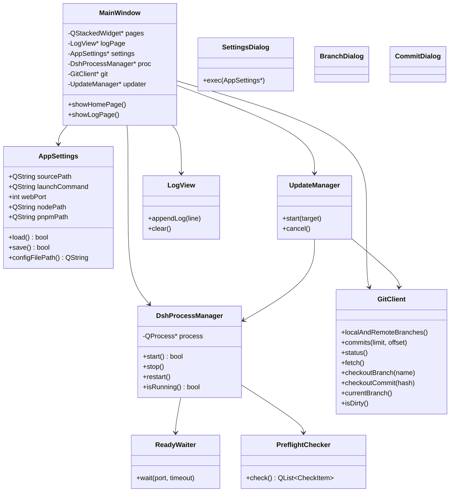
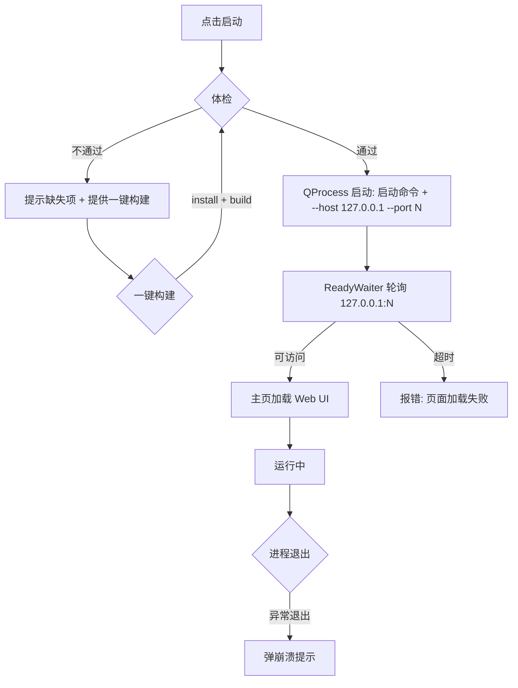
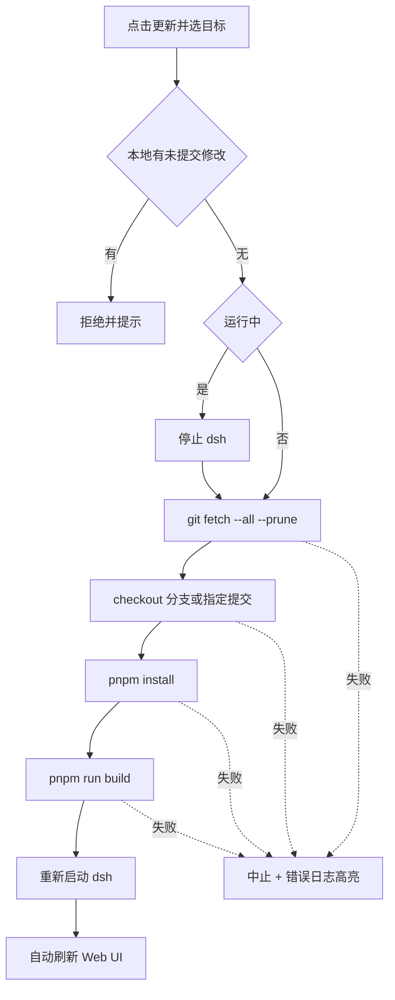

# deepseek-harness 本地客户端外壳（dshinqt）技术方案

## 1. 环境前提

| 组件 | 要求 | 备注 |
| --- | --- | --- |
| Qt | 6.x（含 QtWebEngine 模块） | 已定案（Qt5.12.12 的 WebEngine 内核过旧，无法渲染 dsh 前端） |
| 编译器 | MSVC 2022 | 用户将安装 VS2022（原 VS 2017 不支持 Qt6 官方二进制包） |
| CMake | ≥ 3.21 | 本机 3.26 满足 |
| git | 系统 `git` 命令 | 已具备 |
| node | ≥ 22.19 | 已具备 |
| pnpm | 11.x | 已具备 |

> 注：QtWebEngine 携带 Chromium 内核，体积较大，首次配置需安装对应版本的 QtWebEngine 组件。

## 2. 工程结构

```
dshinqt/
├── CMakeLists.txt
├── docs/
│   ├── spec.md
│   ├── implementation.md
│   └── phases/                    # 阶段拆解文档（见阶段④）
├── src/
│   ├── main.cpp
│   ├── mainwindow.{h,cpp}         # 主窗口：菜单栏 + QStackedWidget + 状态栏
│   ├── settings/
│   │   ├── appsettings.{h,cpp}    # 配置结构 + JSON 读写
│   │   └── settingsdialog.{h,cpp} # 设置对话框
│   ├── process/
│   │   ├── dshprocessmanager.{h,cpp}  # dsh 进程生命周期
│   │   ├── preflightchecker.{h,cpp}   # 启动前体检
│   │   └── readywaiter.{h,cpp}        # 端口就绪轮询
│   ├── git/
│   │   └── gitclient.{h,cpp}          # subprocess 调 git
│   ├── update/
│   │   └── updatemanager.{h,cpp}      # 更新流水线
│   └── ui/
│       ├── logview.{h,cpp}            # 日志页
│       ├── branchdialog.{h,cpp}       # 分支查看/切换对话框
│       └── commitdialog.{h,cpp}       # 提交选择对话框（含搜索）
└── tests/                         # 单元测试（Qt Test）
```

## 3. 类设计

### 3.1 类图



### 3.2 核心类说明

| 类 | 职责 | 关键成员/方法 |
| --- | --- | --- |
| `AppSettings` | 配置结构体与持久化 | `sourcePath`、`launchCommand`、`webPort`、`nodePath`、`pnpmPath`；`load()/save()` |
| `SettingsDialog` | 设置编辑界面与校验 | 校验源码路径存在且含 `pnpm-workspace.yaml`、端口 1–65535 |
| `DshProcessManager` | 进程生命周期 | `start/stop/restart/isRunning`；信号 `stateChanged`、`logOutput`、`crashed` |
| `PreflightChecker` | 启动前体检 | 逐项检查 node/pnpm 版本、`node_modules/`、`apps/web/dist/`、`packages/**/lib` |
| `ReadyWaiter` | 端口就绪轮询 | `wait(port, timeout)`；信号 `ready`、`timeout` |
| `GitClient` | git 命令封装 | 分支/提交/状态/fetch/checkout/isDirty，异步返回 |
| `UpdateManager` | 更新流水线状态机 | `start(target)`；信号 `stageChanged`、`finished` |
| `LogView` | 日志页视图 | `appendLog/clear`，高亮错误行 |

## 4. 关键技术路径

### 4.1 启动流程



### 4.2 更新流程



### 4.3 端口联动判定

- 设置里「启动命令」只存命令主体（默认 `pnpm dsh web`），不含端口。
- 外壳启动时在命令尾部追加 `--host 127.0.0.1 --port <端口>`。
- 若用户手动在命令主体中写入了 `--port`/`--host`，启动前先剥离这些参数，再以端口字段为准（避免双端口冲突）。

## 5. 兼容性策略

| 组件 | 首选 | 兼容/降级 | 说明 |
| --- | --- | --- | --- |
| Qt | 6.x（QtWebEngine） | — | 已定案，不降级 |
| C++ 标准 | C++17 | C++20 | Qt6 最低要求 C++17 |
| CMake | 3.21+ | 3.16+ | 依赖 `qt_find_package` 等 |
| 编译器 | MSVC 2022 | MSVC 2019+ | Qt6 官方二进制包支持 |
| git | 系统 git ≥ 2.x | — | 统一走 subprocess |
| 端口 | `--port <N>`（dsh 原生支持） | — | 默认 3080 |

## 6. 示例用法代码

`DshProcessManager` 启动关键逻辑（示意）：

```cpp
void DshProcessManager::start()
{
    const auto &s = *m_settings;

    // 启动命令主体：默认 "pnpm dsh web"
    QString program = s.launchCommand.section(' ', 0, 0);
    QStringList args = s.launchCommand.section(' ', 1).split(' ', Qt::SkipEmptyParts);

    // 剥离用户手写的 --host / --port，避免与设置冲突
    args.removeAll("--host");
    args.removeAll("--port");

    // 追加端口联动参数
    args << "--host" << "127.0.0.1"
         << "--port" << QString::number(s.webPort);

    m_process->setWorkingDirectory(s.sourcePath);
    m_process->start(program, args);
}
```

`main.cpp` 骨架（示意）：

```cpp
int main(int argc, char *argv[])
{
    QApplication app(argc, argv);

    AppSettings settings;
    settings.load();

    MainWindow w(&settings);
    w.show();
    return app.exec();
}
```

## 7. 实施阶段拆分（概览）

| 阶段 | 内容 | 依赖 |
| --- | --- | --- |
| Phase 1 | 工程骨架：CMake + main + MainWindow + QWebEngineView 加载页面 | — |
| Phase 2 | 设置管理：AppSettings + SettingsDialog + JSON 持久化 | Phase 1 |
| Phase 3 | 进程管理：DshProcessManager + 体检 + 就绪等待 + 日志页 | Phase 2 |
| Phase 4 | Git 查看：GitClient + 分支/提交/状态对话框 | Phase 1 |
| Phase 5 | 更新管理：UpdateManager 流水线 + 进度/错误展示 | Phase 3、4 |
| Phase 6 | 收尾：单实例、崩溃提示、启动自动 fetch、跨平台验证 | Phase 5 |

> 各阶段的任务清单、验收标准、产出文件将在 `docs/phases/` 中逐份展开。
