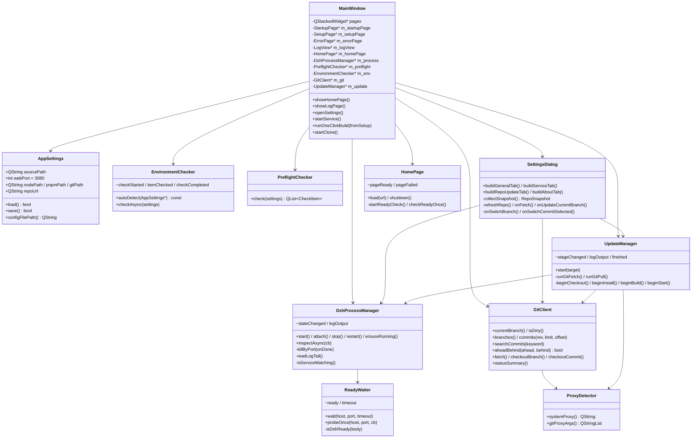
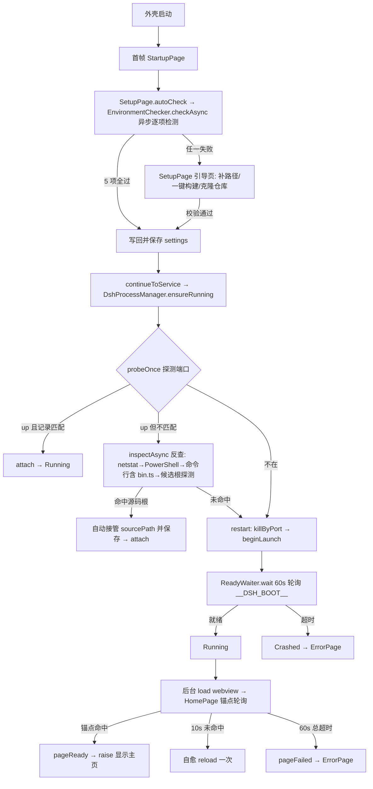
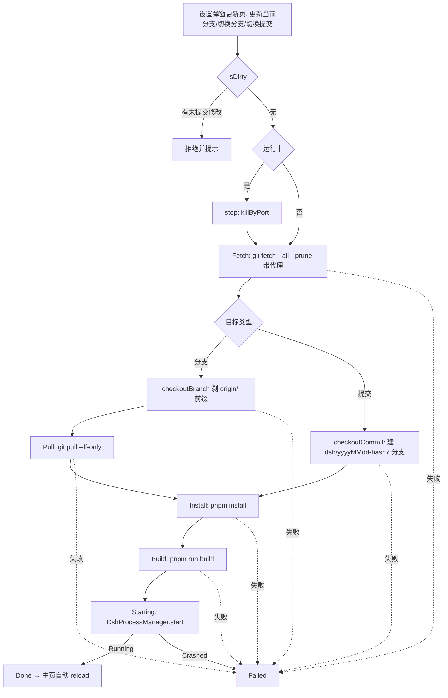

# deepseek-harness 本地客户端外壳（dshinqt）技术方案

> 文档状态：已同步至当前实现（对应 git commit `9a5a4ad` 及后续 refactor）。
> 本文描述**实际代码结构**与关键技术路径；早期设计中的差异在对应小节注明。
>
> **命名空间约定**：本工程全部 C++ 类型定义于 `namespace dshinqt` 内
> （如 `dshinqt::DshProcessManager`），为简洁，正文与类图中省略 `dshinqt::` 前缀。

## 1. 环境前提

| 组件 | 要求 | 备注 |
| --- | --- | --- |
| Qt | 6.x（Widgets / WebEngineWidgets / Concurrent） | 本机 Qt 6.11.1 msvc2022_64 |
| 编译器 | MSVC 2022（VS 2026） | CMake preset：`Visual Studio 18 2026` / x64 |
| CMake | ≥ 3.21 | 本机满足 |
| git | 系统 `git` 命令 | 自动探测，可在设置中指定路径 |
| node | ≥ 22.19 | 自动探测，可在设置中指定路径 |
| pnpm | 任意（11.x 验证） | 自动探测，可在设置中指定路径 |

- CMake preset：`msvc2022`（`CMAKE_PREFIX_PATH=D:/framework/qt6/6.11.1/msvc2022_64`，`CMAKE_INSTALL_PREFIX=<src>/install`），构建 preset `debug` / `release`。
- 源文件为 UTF-8（无 BOM）：MSVC 下通过 `add_compile_options("/utf-8")` 显式指定编码，避免中文按系统代码页解析出错。
- 源文件用 `file(GLOB_RECURSE ... CONFIGURE_DEPENDS)` 自动搜集，新增/删除文件无需手改 CMakeLists。
- 安装规则：`qt_generate_deploy_app_script` 自动部署 Qt 运行时（含 `QtWebEngineProcess.exe`）。

## 2. 工程结构

```
dshinqt/
├── CMakeLists.txt                  # glob 搜集 src/，WIN32_EXECUTABLE，部署脚本
├── CMakePresets.json               # msvc2022（VS 2026 x64）+ debug/release
├── docs/
│   ├── spec.md                     # 规格说明（定版，实现级）
│   ├── implementation.md           # 本文
│   ├── requirment.md               # 需求文档
│   └── phases/                     # 阶段拆解（已完成/未完成标注）
├── resources/
│   ├── resources.qrc               # :/app.ico
│   ├── app.rc / app.ico            # Windows 图标
├── src/
│   ├── main.cpp                    # OpenGL 前置设置 + 深色主题 + debug.log
│   ├── mainwindow.{h,cpp}          # 四页 QStackedWidget + webview 叠放 + 状态栏
│   ├── settings/
│   │   ├── appsettings.{h,cpp}     # 配置结构 + JSON 读写（exe 旁 config/config.json）
│   │   └── settingsdialog.{h,cpp}  # 设置弹窗：常规/服务/更新/关于 四页导航
│   ├── process/
│   │   ├── dshprocessmanager.{h,cpp}   # 常驻服务：ensureRunning/attach/反查/杀端口/tail 日志
│   │   ├── environmentchecker.{h,cpp}  # 五项环境检测（异步逐项）+ autoDetect 回填
│   │   ├── preflightchecker.{h,cpp}    # 依赖与构建产物体检（node_modules/dist/packages lib）
│   │   ├── readywaiter.{h,cpp}         # 端口就绪轮询（__DSH_BOOT__ 正面判定）+ probeOnce
│   │   ├── proxydetector.{h,cpp}       # 系统代理检测 → git 参数 / pnpm 环境变量
│   │   ├── startwrapped.h              # cmd.exe /c 包装 shim（内联）
│   │   └── startdetached.cpp           # 分离启动（CreateProcessW + CREATE_NEW_CONSOLE（隐藏控制台，避免子命令闪窗抢焦点））
│   ├── git/
│   │   └── gitclient.{h,cpp}           # subprocess 调 git（同步，20s 超时，注入代理）
│   ├── update/
│   │   └── updatemanager.{h,cpp}       # 更新流水线状态机（含 Pull 阶段）
│   └── ui/
│       ├── homepage.{h,cpp}            # webview 主页 + 正面锚点就绪判定 + 自愈 reload
│       ├── startuppage.{h,cpp}         # 启动加载页（不确定进度条）
│       ├── setuppage.{h,cpp}           # 引导页（路径补全/一键构建/克隆）
│       ├── errorpage.{h,cpp}           # 错误页（重试/一键构建/查看日志）
│       └── logview.{h,cpp}             # 日志页（深色终端，错误行红色）
└── install/                        # 部署产物（gitignored）
```

> 早期设计（菜单栏 + 独立 BranchDialog/CommitDialog + QStandardPaths 配置 + QProcess 子进程）
> 已整体演进；`branchdialog` / `commitdialog` 死代码已删除。

## 3. 类设计

### 3.1 类图



### 3.2 核心类说明

| 类 | 职责 | 关键成员/方法 |
| --- | --- | --- |
| `AppSettings` | 配置结构体与 JSON 持久化 | `sourcePath/webPort/nodePath/pnpmPath/gitPath/repoUrl`；`load()/save()`；文件 = exe 旁 `config/config.json` |
| `EnvironmentChecker` | 五项环境检测 + 自动探测回填 | `checkAsync`（异步逐项，信号实时反馈）；`autoDetect`（PATH 回填空字段）；node ≥ 22.19 版本解析 |
| `PreflightChecker` | 依赖与构建产物体检 | node_modules / `apps/web/dist` / `packages/**/lib`（任一非空 lib） |
| `DshProcessManager` | 常驻服务全生命周期 | `ensureRunning`（探测→attach/接管/杀旧启新）；`inspectAsync`（netstat→PowerShell 反查）；`killByPort`（taskkill /t /f）；日志 tail |
| `ReadyWaiter` | 端口就绪轮询 | `wait(host,port,60s)`；判定 body 含 `__DSH_BOOT__`；`probeOnce` 单次探测回调 |
| `ProxyDetector` | 系统代理检测 | Windows 注册表 / Unix 环境变量；`gitProxyArgs` 生成 `-c http.proxy=` 参数 |
| `GitClient` | git 命令封装（同步 subprocess） | `branches`（本地+远程）/`commits(rev,limit,offset)`/`searchCommits`/`aheadBehind`/`fetch`/`checkoutBranch`/`checkoutCommit`（自动建分支）/`isDirty` |
| `UpdateManager` | 更新流水线状态机 | `Idle→Stopping→Fetch→Checkout→Pull→Install→Build→Starting→Done/Failed`；全异步 QProcess 串联 |
| `SettingsDialog` | 统一设置弹窗（四页导航） | 常规（6 项配置）/ 服务（状态+启动停止重启）/ 更新（Git 查看+操作）/ 关于；后台线程采仓库快照 |
| `HomePage` | webview 主页与就绪判定 | 正面锚点轮询（`[data-composer-card]`+`[data-conversation-scroll]`）；10s 自愈 reload；60s 超时 pageFailed |
| `SetupPage` | 引导页 | 四项路径 + 实时状态 + 校验/一键构建/克隆；校验通过写回 settings |
| `LogView` | 日志页 | `appendLog(line, isError)`；`\r` 进度覆盖符转行；错误行红色 |
| `startWrapped`/`startDetachedWrapped` | 进程启动工具 | shim 经 `cmd.exe /c`；分离启动经 `CreateProcessW + CREATE_NEW_CONSOLE（隐藏控制台，避免子命令闪窗抢焦点）`（Windows）/ `/bin/sh -c`（其他） |

## 4. 关键技术路径

### 4.1 启动流程（完整链路）



### 4.2 常驻服务与监督

- **分离启动**（`startdetached.cpp`）：Windows 用 `CreateProcessW`，标志 `CREATE_NEW_CONSOLE（隐藏控制台，避免子命令闪窗抢焦点） | CREATE_NEW_PROCESS_GROUP`；stdin→NUL，stdout/stderr 句柄重定向到 `config/dsh-web.log`（`STARTF_USESTDHANDLES` + 继承句柄），进程完全脱离外壳，关闭外壳不影响。
- **状态监督**：不持有子进程句柄（句柄已 CloseHandle）。`ReadyWaiter.wait` 就绪后，1s 定时器增量 tail 日志文件（`m_logPos` 记录偏移，UTF-8 按行拆发 `logOutput`）。
- **端口反查**（`inspectAsync`，Windows）：`netstat -ano` 找 `:<port>` + `LISTENING` 的 PID → `powershell -Command "Get-CimInstance Win32_Process -Filter 'ProcessId=<pid>'"` 取 CommandLine/ExecutablePath → 命令行含 `bin.ts` 判定是 dsh → 候选源码根探测（配置路径 → 命令行中绝对 `apps/cli/src/bin.ts` 路径的上一级 → `D:/framework/deepseek-harness`），命中条件 = `apps/cli/src/bin.ts` 与 `pnpm-workspace.yaml` 都存在。
- **记录文件**：`config/service-source.txt` 记录本次启动的源码路径，用于 attach 匹配判定；停止时删除。
- 非 Windows 平台：`inspectAsync`/`killByPort` 直接回调空结果（走启动/重启流程），保证可编译。

### 4.3 就绪判定（两层正面信号）

| 层 | 判定 | 超时 |
| --- | --- | --- |
| 服务层（ReadyWaiter） | GET `/` 响应体含 `__DSH_BOOT__`（dsh boot 数据） | 60s → Crashed |
| 界面层（HomePage） | `runJavaScript`：`[data-composer-card]`（输入区）与 `[data-conversation-scroll]`（会话区）均挂载 | 单周期 10s 自愈 reload；总 60s → pageFailed |

设计原则：只判「该出现的东西出现没有」，不枚举任何 warning（dsh 早期加载会出现 "failed to load plugins" 等警告，属正常现象）。

### 4.4 更新流程



- 全程 QProcess 异步串联（信号槽驱动，`readyReadStandardOutput` 增量转发日志），无 `waitForFinished` 阻塞。
- pnpm 是 `.cmd` shim 时经 `cmd.exe /c` 包装（`startWrapped`）。
- 失败路径：`fail()` → stage `Failed` + 日志高亮 + `finished(false, error)` → 主窗口弹警告并切日志页。

### 4.5 代理注入（ProxyDetector）

- Windows：读注册表 `HKCU\Software\Microsoft\Windows\CurrentVersion\Internet Settings` 的 `ProxyEnable`/`ProxyServer`；支持 `http=...;https=...;socks=...` 多协议段（取 http/https）；无协议标记时整体作为 http 代理；仅含 socks 等协议时跳过注入；未启用返回空。
- Unix/macOS：依次读 `HTTPS_PROXY/https_proxy/HTTP_PROXY/http_proxy/ALL_PROXY/all_proxy` 环境变量。
- git 命令统一注入 `-c http.proxy=<url> -c https.proxy=<url>`（git 不读 Windows 系统代理）。
- pnpm install/build 时注入 `HTTPS_PROXY/HTTP_PROXY`（及小写）环境变量（pnpm 不读 Windows 系统代理）。
- 代理 URL 补全：`host:port` → `http://host:port`（`toProxyUrl`）。

### 4.6 Git 调用约定

- 统一 subprocess 调系统 `git`（`GitClient::run`：`waitForStarted`/`waitForFinished` 20s 超时，读 stderr 为错误信息）。
- 提交列表格式：`git log --pretty=format:%H%x09%an%x09%ad%x09%s --date=short [rev] --skip=<offset> -n <limit>`，按 `\t` 拆四段（hash/作者/日期/消息）。
- 分支列表：`git for-each-ref --format=%(refname:short) refs/heads`（本地）+ `refs/remotes`（远程）。
- 领先/落后：`git rev-list --left-right --count HEAD...@{upstream}`。
- 切换提交：优先 `git checkout dsh/yyyyMMdd-<hash7>`（已存在则直接检出），失败再 `git checkout -b dsh/yyyyMMdd-<hash7> <hash>`——避免 detached HEAD。

## 5. 兼容性策略

| 组件 | 首选 | 兼容/降级 | 说明 |
| --- | --- | --- | --- |
| Qt | 6.x（QtWebEngine） | — | 已定案，不降级 |
| C++ 标准 | C++17 | — | Qt6 最低要求 |
| CMake | 3.21+ | — | preset 固定 VS 2026 x64 |
| 编译器 | MSVC 2022 | — | 本机 VS 2026 |
| git | 系统 git ≥ 2.x | — | 统一 subprocess，可指定路径 |
| node | ≥ 22.19 | — | 版本解析校验 |
| 端口 | `--port <N>` | — | 默认 3080，外壳追加参数 |
| Windows 反查 | netstat + PowerShell | 非 Windows 直接回调空 | 保证跨平台编译 |

## 6. 示例用法代码

### 6.1 分离启动（核心逻辑示意，Windows）

```cpp
// startdetached.cpp：node 直启 dsh，CREATE_NEW_CONSOLE（隐藏控制台，避免子命令闪窗抢焦点） 脱离外壳
QString cmd = shellQuote(node);                       // node.exe
for (const QString &a : args)
    cmd += ' ' + shellQuote(a);
// args = --import tsx/esm apps/cli/src/bin.ts web --host 127.0.0.1 --port <N>

STARTUPINFOW si{};
si.cb = sizeof(si);
si.dwFlags = STARTF_USESTDHANDLES | STARTF_USESHOWWINDOW;
si.wShowWindow = SW_HIDE;
si.hStdInput  = hNul;                                  // stdin → NUL
si.hStdOutput = hLog;                                  // stdout/stderr → dsh-web.log
si.hStdError  = hLog;

CreateProcessW(nullptr, cmdLine,
    nullptr, nullptr, TRUE,                             // 继承句柄
    CREATE_NEW_CONSOLE（隐藏控制台，避免子命令闪窗抢焦点） | CREATE_NEW_PROCESS_GROUP,
    nullptr, workingDirectory, &si, &pi);
```

### 6.2 服务监督（ensureRunning 决策树示意）

```cpp
void DshProcessManager::ensureRunning()
{
    m_waiter->probeOnce("127.0.0.1", m_settings->webPort, [this](bool up) {
        if (up) {
            if (isServiceMatching(m_settings->sourcePath))
                attach();                               // 记录匹配 → 直接连接
            else
                inspectAsync([this](const ServiceInfo &info) {
                    if (info.ok && !info.sourceRoot.isEmpty()) {
                        m_settings->sourcePath = info.sourceRoot;  // 自动接管
                        m_settings->save();
                        attach();
                    } else
                        restart();                      // 未知服务 → 杀旧启新
                });
        } else
            start();                                    // 端口不在 → 启动
    });
}
```

### 6.3 就绪判定（HomePage 锚点轮询示意）

```cpp
// 每次 loadFinished 后启动；500ms 间隔
const char kJsReadyCheck[] =
    "!!document.querySelector('[data-composer-card]')"
    " && !!document.querySelector('[data-conversation-scroll]')";

m_webView->page()->runJavaScript(kJsReadyCheck, [this](const QVariant &v) {
    if (v.toBool()) { stop(); emit pageReady(); return; }
    if (!m_reloaded && cycle >= 10000) { m_webView->reload(); return; }  // 自愈
    if (elapsed >= 60000) { stop(); emit pageFailed(); return; }          // 总超时
});
```

## 7. 实施阶段拆分（当前状态）

| 阶段 | 内容 | 状态 |
| --- | --- | --- |
| Phase 1 | 工程骨架：CMake + main + MainWindow + webview 加载页面 | ✅ 完成（架构演进：无菜单栏，webview 与 stackwidget 叠放） |
| Phase 2 | 设置管理：AppSettings + SettingsDialog + JSON 持久化 | ✅ 完成（字段与存储位置已变：去 launchCommand，增 gitPath/repoUrl，exe 旁 config） |
| Phase 3 | 进程管理：常驻服务 + 体检 + 就绪等待 + 日志页 | ✅ 完成（演进为分离常驻模型 + 端口反查接管 + 引导/错误页） |
| Phase 4 | Git 查看：GitClient + 分支/提交/状态 | ✅ 完成（并入设置弹窗「更新」页；BranchDialog/CommitDialog 死代码已删除） |
| Phase 5 | 更新管理：UpdateManager 流水线 + 进度/错误展示 | ✅ 完成（新增 Pull 阶段；切换提交自动建分支） |
| Phase 6 | 收尾：单实例、启动自动 fetch、状态栏、崩溃提示、跨平台 | ⏳ **部分完成**：跨平台可编译已具备、死代码已清理；单实例 / 自动 fetch / 状态栏分支 / 崩溃日志摘要未实现 |

> 各阶段的任务清单与验收结果详见 `docs/phases/`。
